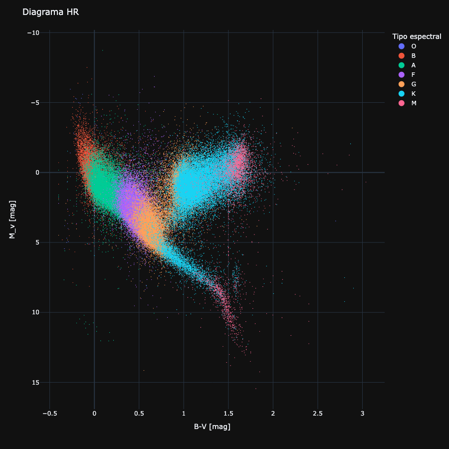

# Mi Portfolio de Análisis y Ciencia de Datos

Mi nombre es Enrique Vasallo y soy un físico con experiencia en análisis y ciencia de datos.

## Proyectos de análisis y ciencia de datos

- [Análisis del catálogo astronómico Hipparcos](https://github.com/Vasallo94/Hipparcos) - Análisis del catálogo astronómico Hipparcos, que contiene información detallada sobre las estrellas de nuestra galaxia. 

 

- [Oporto](https://github.com/Vasallo94/Porto) - Un estudio de los datos de Airbnb de la ciudad de Oporto y alrededores.
- [Humedades](https://github.com/Vasallo94/Humedades) - Seguimiento de las humedades y la temperatura de mi casa.
- [Titanic](https://github.com/Vasallo94/Titanic_analysis) - Análisis de los datos de la tragedia del Titanic

## Otros proyectos
- [El juego de la vida](https://github.com/Vasallo94/El_Juego_de_la_Vida_de_Conway) - Implementación del Juego de la Vida de Conway en Python utilizando la biblioteca Pygame. 

 

- [Fractales](https://github.com/Vasallo94/Fractales) - Aplicación web para representar fractales

 

## Contacto

Puedes contactarme a través de mi [perfil de LinkedIn](https://www.linkedin.com/in/enrique-vasallo/) o por <quiquevasallo@gmail.com>.

